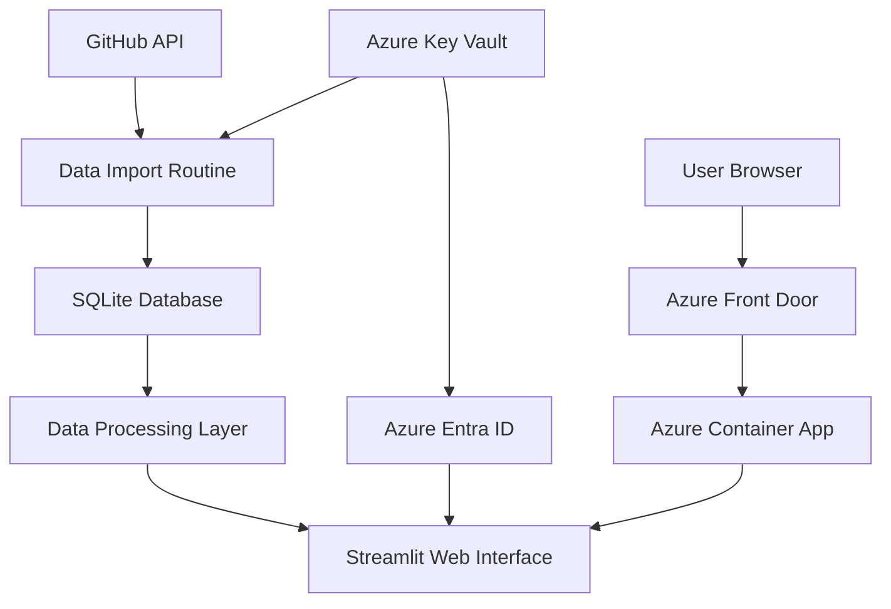

# Architecture

## Requirements Summary

The GitHub Copilot Statistics App must satisfy the following key requirements:

1. **Data Collection**: Collect GitHub Copilot usage metrics from the GitHub API across multiple organizations.
2. **Security**: Secure access to GitHub tokens and ensure proper authentication via Azure Entra ID.
3. **Performance**: Process and visualize metrics data efficiently with minimal latency.
4. **Extensibility**: Support addition of new metrics and visualization types over time.
5. **Privacy**: Ensure compliance with data protection regulations when handling usage statistics.
6. **Integration**: Provide a simple web interface via Streamlit for interactive data analysis.
7. **Persistence**: Store collected metrics reliably in a SQLite database for historical analysis.

## Component Diagram

## Key Software Components

### Data Collectors
- **GitHub API Client**: Interfaces with GitHub to collect repository and code information.
- **Copilot Event Listener**: Captures events from GitHub Copilot extension.
- **Integration Adapters**: Connects with CI/CD systems and development environments.

### Data Processing Pipeline
- **ETL Processes**: Extracts, transforms, and loads data into the analytics store.
- **Aggregation Service**: Combines data points into meaningful metrics.
- **Anomaly Detection**: Identifies unusual patterns in usage data.

### Analytics Engine
- **Statistical Analyzer**: Applies statistical methods to extract insights.
- **Trend Detector**: Identifies changes in usage patterns over time.
- **Recommendation Engine**: Suggests optimization opportunities.

### Presentation Layer
- **API Gateway**: Provides secure access to data and services.
- **Dashboard Application**: Interactive web interface for data visualization.
- **Report Generator**: Creates scheduled and on-demand reports.

## Integration Points

The system integrates with external systems through the following interfaces:

1. **GitHub Integration**
   - OAuth authentication for user access.
   - REST and GraphQL API clients for data collection.
   - Webhook receivers for real-time event processing.

2. **Development Environment Integration**
   - VS Code extension integration.
   - JetBrains IDE plugin support.
   - Web editor compatibility.

3. **Enterprise Systems**
   - LDAP/Active Directory for user management.
   - SSO providers for authentication.
   - Data export for enterprise analytics platforms.

4. **CI/CD Pipeline**
   - Integration with GitHub Actions.
   - Jenkins plugin support.
   - Build process analytics.