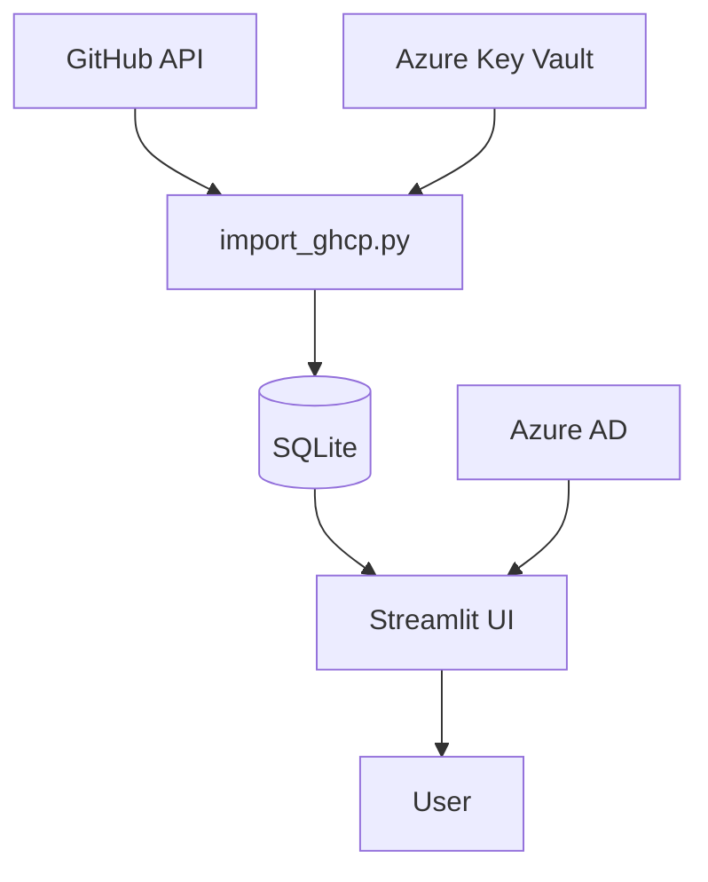

# Architecture

## Requirements

1. Download Copilot metrics from the GitHub API for a configurable list of organisations.
2. Store records in a local SQLite database.
3. Display aggregated metrics in a Streamlit dashboard.
4. Require authentication via Azure AD when deployed.
5. Allow scheduled imports when the application is running continuously.

## Component diagram

## Major components

### import_ghcp.py
Fetches metrics for each organisation listed in `ORG_LIST` and saves them into the SQLite database. When running in Azure it copies the database file to and from a mounted file share to avoid locking issues.

### Streamlit UI
Consists of `app.py` plus two pages under `pages/`. The UI reads from the database using helper functions in `utils/helpers.py` and displays Altair charts.

### Authentication
`utils/auth.py` and `utils/auth_wrapper.py` implement login with Azure Active Directory using MSAL. A token is stored in Streamlit session state.
