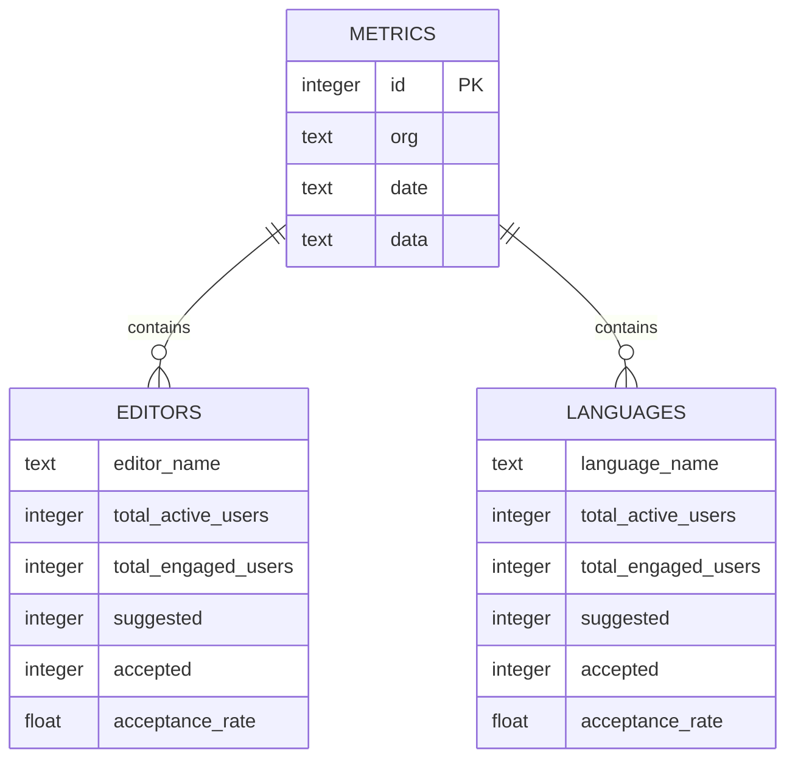

# Data Architecture

## Data Models

GHCP-Stats processes and stores GitHub Copilot usage metrics obtained from the GitHub API. The application uses the following data models:

### Metrics Table

The `metrics` table in SQLite stores GitHub Copilot usage data:

```sql
CREATE TABLE metrics (
  id INTEGER PRIMARY KEY AUTOINCREMENT,
  org TEXT,
  date TEXT,
  data TEXT
);
```

- **id**: Unique identifier for each record
- **org**: Organization name associated with the metrics
- **date**: Date of the metrics in YYYY-MM-DD format
- **data**: JSON-encoded string containing detailed metrics

#### Example JSON Data Structures

```json
{
  "total_active_users": 100,
  "total_inactive_users": 50,
  "total_engaged_users": 75,
  "suggested": 500,
  "accepted": 300,
  "acceptance_rate": 60.0,
  "editors": [
  {
    "editor_name": "VSCode",
    "total_active_users": 80,
    "total_engaged_users": 60,
    "suggested": 400,
    "accepted": 250,
    "acceptance_rate": 62.5
  }
  ],
  "languages": [
  {
    "language_name": "Python",
    "total_active_users": 50,
    "total_engaged_users": 40,
    "suggested": 300,
    "accepted": 200,
    "acceptance_rate": 66.7
  }
  ]
}
```

```json
{
  "privacyLevel": "standard",
  "dashboardLayout": {
  "theme": "dark",
  "widgets": ["metrics", "charts", "trends"]
  }
}
```

## Storage Solutions

GHCP-Stats uses SQLite as the primary data store for its simplicity and portability. The following storage strategies are implemented:

### Primary Data Store

- **SQLite**: Lightweight relational database for storing metrics data
- **Schema**: A single metrics table with JSON-encoded data for flexibility
- **Indexes**: Indexes can be added on `org` and `date` for faster queries

### Caching Layer

- **Streamlit Cache**: Used for caching database queries and improving performance
- **Example**: `@st.cache_data` decorator is applied to functions like `get_org_options()` and `load_metrics()`

### Blob Storage

- **Database Export/Import**: SQLite database can be exported and imported using .sql dumps

#### Export Example:

```python
db_path = "metrics.db"
db_dump = subprocess.check_output(["sqlite3", db_path, ".dump"], text=True)
```

#### Import Example:

```python
subprocess.run(["sqlite3", "metrics.db", ".read imported.sql"])
```

## Entity Relationships

The application uses a flat structure for storing metrics in SQLite, with JSON-encoded data providing flexibility for nested structures. Relationships are inferred from the JSON structure.

## Data Relationships

The following diagram illustrates the relationship between metrics and their nested components:



Note: Although EDITORS and LANGUAGES appear as separate entities in this diagram, they are actually stored as nested JSON structures within the `data` column of the METRICS table.

### Key Relationships

- **Metrics**: Central table storing all usage data
- **Editors**: Nested within the data JSON, representing metrics by editor (e.g., VSCode)
- **Languages**: Nested within the data JSON, representing metrics by programming language

## Query Examples

### Retrieve All Organizations

```python
def get_org_options():
  conn = get_connection()
  cur = conn.cursor()
  cur.execute("SELECT DISTINCT org FROM metrics")
  orgs = sorted([row[0] for row in cur.fetchall()])
  conn.close()
  return orgs
```

### Load Metrics for a Date Range

```python
def load_metrics(date_range: tuple[str, str], orgs: list[str]) -> list[dict]:
  conn = get_connection()
  cur = conn.cursor()
  query = """
    SELECT date, org, data
    FROM metrics
    WHERE date BETWEEN ? AND ?
    AND org IN ({})
  """.format(",".join("?" * len(orgs)))
  cur.execute(query, (date_range[0], date_range[1], *orgs))
  records = cur.fetchall()
  conn.close()
  return [{"date": row[0], "org": row[1], "data": json.loads(row[2])} for row in records]
```

### Record Code Metrics

```python
def record_code_metrics(record: dict, sel_editors: list[str], sel_languages: list[str]) -> tuple[int, int]:
  suggested, accepted = 0, 0
  comp = record["data"].get("copilot_ide_code_completions")
  if comp:
    for editor in comp.get("editors", []):
      if sel_editors and editor.get("name") not in sel_editors:
        continue
      for lang in editor.get("languages", []):
        if sel_languages and lang.get("name") not in sel_languages:
          continue
        suggested += lang.get("total_code_lines_suggested", 0)
        accepted += lang.get("total_code_lines_accepted", 0)
  return suggested, accepted
```